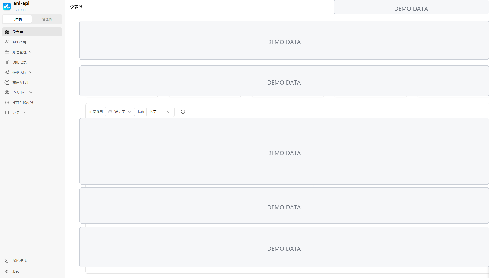
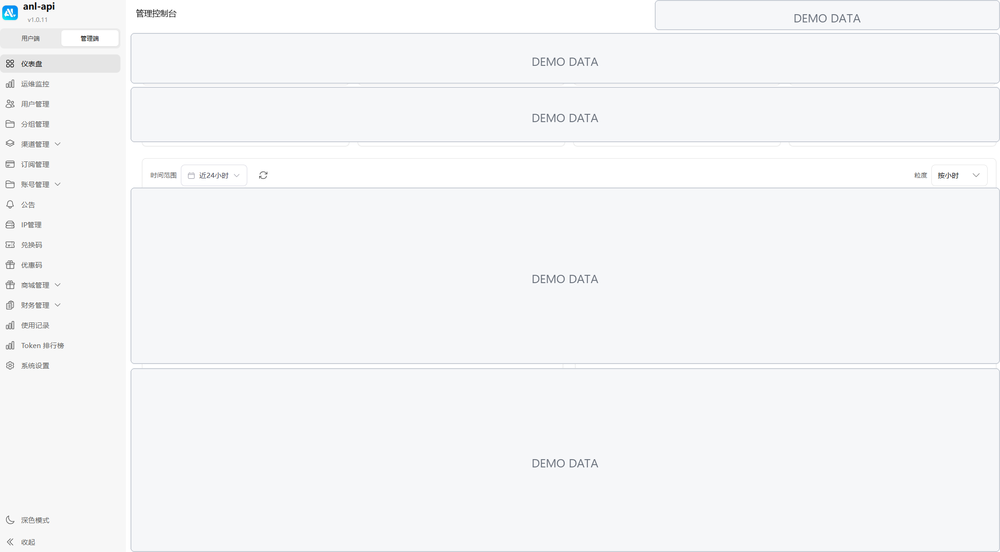

# ANLAPI


`ANLAPI` is a self-hosted AI API gateway and operations console for multi-model access. It brings upstream accounts, channels, and models behind OpenAI-compatible endpoints, with account isolation, group routing, API keys, usage analytics, billing, subscriptions, and administration workflows.

[中文主说明](README.md) | English | [Live console](https://anlmc.top/home) | [Deployment guide](deploy/README.md)

The current product version is `ANLAPI 1.0.11`. It is independently maintained and continuously refined around real deployment needs across gateway, console, billing, and operations.

## Project overview

ANLAPI is intended for operators who need one controlled entry point for multiple AI providers. Administrators configure legitimate upstream accounts or channels, groups, model mappings, and billing rules. Users then call the models allowed by their API key and view balances, request records, and usage trends in the console.

The repository contains source code, configuration templates, migrations, deployment examples, tests, and public assets. It does not contain production databases, OAuth credentials, payment secrets, server passwords, or real user data.

## Core capabilities

### Engineering highlights

This repository represents a full-stack system shaped by real deployment requirements:

- Go gateway services and a Vue 3 console developed as one product.
- Multi-upstream accounts, channels, model groups, failover, and request-level routing.
- Complete operations flows for balances, usage, subscriptions, payments, revenue, and orders.
- OAuth, API keys, passkeys, request auditing, content moderation, and risk controls.
- SSE, WebSocket, Realtime/Live, asynchronous image jobs, and OpenAI-compatible APIs.
- PostgreSQL migrations, Redis caching, Docker Compose, systemd, disaster recovery, and release gates.
- Vitest, Go test, type checks, i18n audits, and security scans for release quality.

### OpenAI-compatible gateway

- OpenAI-compatible `chat`, `responses`, `models`, `embeddings`, image, and streaming endpoints.
- Unified routing across different upstream account and channel types, including failover and request/response adaptation.
- Codex-compatible request handling, including compatible forwarding of client intent where supported by the upstream.
- Optional asynchronous image submission and polling for long-running image jobs; see [Async image tasks](docs/ASYNC_IMAGE_TASKS.md).

### DeepSeek V4

ANLAPI provides a dedicated DeepSeek setup path while keeping the client-facing API OpenAI-compatible:

- In the admin console, choose the **DeepSeek** shortcut when creating an API-key account. The official base URL (`https://api.deepseek.com`) and supported model candidates are prefilled. The upstream key remains server-side and is not exposed through the client API.
- The built-in V4 models are `deepseek-v4-flash` and `deepseek-v4-pro`. Public aliases can still be mapped to upstream models through the normal account and group configuration.
- Clients can call `POST /v1/chat/completions` as usual. The gateway selects the upstream protocol by model capability: V4 Flash uses the official Responses route, while V4 Pro uses Chat Completions.
- Reasoning controls accept the standard `reasoning_effort` form and the supported nested provider-options form. Explicit client values are preserved and remain subject to administrator-configured group and API-key policies.
- DeepSeek cache-hit usage, including `prompt_cache_hit_tokens`, is parsed into the normalized usage record and billed with the configured cache-read rate. This is usage and billing optimization, not response-content caching.

### Accounts, channels, and groups

- Organize upstream accounts by account type, channel, group, and deployment scope.
- Support public, private, owned, and shared account-pool scheduling boundaries; effective permissions are determined by the current configuration.
- Configure model groups for different use cases, including image-capable groups.
- Keep OAuth accounts and ordinary API-key/channel accounts on separate management and authentication paths.

### User console

- User registration, login, balance, and recharge workflows.
- Create and manage user API keys and grant them access to selected groups.
- View key usage, request records, token trends, model distribution, and time-based consumption summaries.
- Enforce request concurrency at the user-account level.

### Admin console

- Manage users, accounts, channels, groups, API keys, subscriptions, payments, usage, and system settings.
- Configure image-related accounts and groups, request auditing, risk controls, and optional moderation.
- Enable optional payment, email, object-storage, moderation, and OAuth modules according to deployment needs.

## Interface previews

The screenshots below use sanitized demo data to show the customized ANLAPI user and admin experiences. Balances, request counts, tokens, prices, model statistics, accounts, and charts are illustrative only; no real credentials or user data are included.

### User dashboard

The user console brings account status, request usage, token trends, model distribution, and platform consumption into one view.

<p align="center">
  
</p>

### Admin dashboard

The admin console provides operational views for API keys, accounts, users, tokens, model distribution, and request trends.

<p align="center">
  
</p>

## Quick start

After deployment, the usual setup flow is:

1. In the admin console, create an upstream account. For the official DeepSeek API, use the **DeepSeek** shortcut, enter the upstream API key, and keep the prefilled official base URL unless you intentionally use another compatible endpoint.
2. Create or select a group, then configure the public model names and the accounts/models that group may use.
3. Create a user API key and grant it access to the group. The user key is the only credential a client needs to call ANLAPI; upstream credentials stay in the server-side account configuration.
4. Call the OpenAI-compatible endpoint:

```bash
curl https://your-domain.example/v1/chat/completions \
  -H "Authorization: Bearer $ANL_API_KEY" \
  -H "Content-Type: application/json" \
  -d '{
    "model": "deepseek-v4-pro",
    "messages": [{"role": "user", "content": "Hello"}],
    "reasoning_effort": "high",
    "stream": false
  }'
```

The actual model list, routing permissions, billing rate, and upstream availability are controlled by the deployment administrator and the configured provider accounts.

## OpenAI Realtime / Live

When Live is enabled for an OpenAI group, an OpenAI-style alias can be used to create a WebRTC session:

```bash
curl -i https://your-domain.example/v1/realtime/sessions \
  -H "Authorization: Bearer $ANL_API_KEY" \
  -F 'sdp=<offer.sdp' \
  -F 'session={"model":"gpt-live"}'
```

The response body is an SDP answer and the `Location` response header contains a `call_id`. Use the same user API key for the control WebSocket:

```bash
wscat -c 'wss://your-domain.example/v1/realtime?call_id=call_123' \
  -H "Authorization: Bearer $ANL_API_KEY"
```

The existing `POST /v1/live` and `GET /v1/live/:call_id` paths remain available.

## Technology stack

- Backend: Go 1.26.8, Gin, Ent, PostgreSQL, and Redis
- Frontend: Vue 3, TypeScript, Pinia, Vue Router, Tailwind CSS, and Vite
- Testing: Go test, Vitest, `vue-tsc`, and ESLint
- Deployment: Docker Compose or Linux systemd; keep PostgreSQL and Redis persistent outside the application container in production

## Repository structure

```text
.
├── backend/              # Go backend, migrations, services, handlers, and repositories
├── frontend/             # Vue 3 admin and user consoles
├── deploy/               # Docker, systemd, and configuration templates
├── docs/                 # Integration, payment, image-task, and operations docs
├── assets/               # Public project assets
├── tools/                # Development and security-check tools
├── Makefile              # Build and test entry points
└── Dockerfile            # Application image definition
```

## Requirements

- Go 1.26.8
- Node.js 20 or later
- pnpm 9 or later
- PostgreSQL 15 or later
- Redis 7 or later
- Docker and Docker Compose (recommended for deployment)

## Deployment

Read the complete [deployment guide](deploy/README.md) before operating a production instance. A local Docker Compose example is:

```bash
git clone https://github.com/ANL-694/anlapi.git
cd anlapi/deploy
cp .env.example .env
# Set database credentials and fixed security secrets in .env.
chmod 600 .env
docker compose -f docker-compose.local.yml up -d
docker compose -f docker-compose.local.yml logs -f anlapi
```

Before exposing the service publicly, configure a reverse proxy, TLS, trusted proxy settings, database backups, and log retention. Do not copy production configuration or real credentials into the repository.

## Development and checks

```bash
pnpm --dir frontend install
pnpm --dir frontend run dev

cd backend
go run ./cmd/server
```

From the repository root:

```bash
make build
make test
```

You can also run targeted checks:

```bash
cd backend
go test ./...

cd ../frontend
pnpm run test:run
pnpm run typecheck
pnpm run i18n:audit:strict
```

## Security and compliance

- Connect only accounts, channels, and provider APIs that you are authorized to use.
- Never commit API keys, OAuth tokens, payment secrets, database passwords, JWT secrets, or server credentials.
- Use a strong admin password, restrict admin access, and maintain independent backups for PostgreSQL, Redis, and object storage.
- Do not put `/api/*`, `/v1/*`, streaming endpoints, or gateway requests behind a CDN cache. Reverse proxies must preserve WebSocket and long-lived connections.
- Model pricing, availability, quotas, latency, and image parameters depend on administrator configuration and the actual upstream provider. This repository makes no availability or quota guarantees for third-party services.
- Review the applicable laws, data-handling requirements, and provider terms in your jurisdiction.

## Documentation

- [Deployment and operations](deploy/README.md)
- [Async image tasks](docs/ASYNC_IMAGE_TASKS.md)
- [Payment integration](docs/PAYMENT.md)
- [Admin payment API](docs/ADMIN_PAYMENT_INTEGRATION_API.md)
- [Developer guide](DEV_GUIDE.md)
- [Chinese main README](README.md)

## License and upstream

This project is licensed under [LGPL-3.0](LICENSE). The project also acknowledges these upstream projects and their contributors:

- [Wei-Shaw/sub2api](https://github.com/Wei-Shaw/sub2api)
- [PIXEL-API/PixelAPI](https://github.com/PIXEL-API/PixelAPI)

Review the upstream licenses, contribution terms, and third-party dependency licenses before redistribution.
